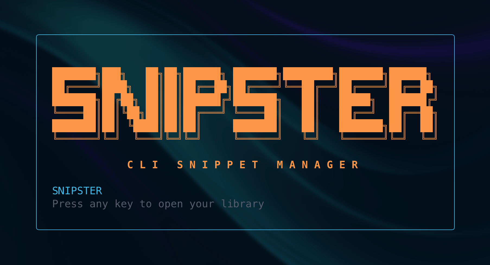
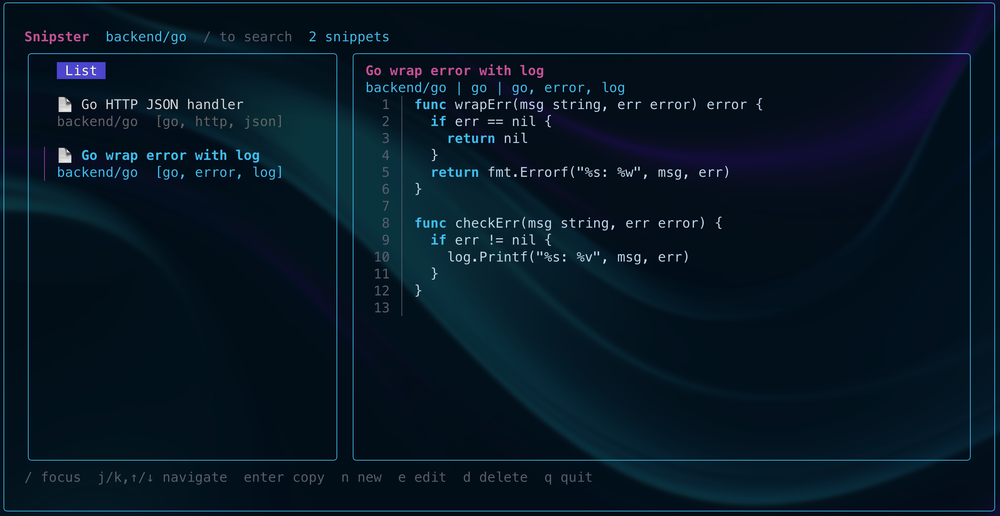

# Snipster ✨

[](https://github.com/HrodWolfS/snipster/releases)
[](https://github.com/HrodWolfS/snipster/actions/workflows/ci.yml)
[](https://goreportcard.com/report/github.com/HrodWolfS/snipster)
[](https://opensource.org/licenses/MIT)
[](go.mod)

> Un gestionnaire de snippets local, élégant et rapide pour le terminal, construit avec Go et Bubble Tea.

Snipster est un TUI pour organiser, rechercher et prévisualiser vos snippets de code stockés en JSON sur le disque. Il propose un explorateur de dossiers à gauche, un aperçu du code à droite, une recherche instantanée avec mode « / », et un CRUD simple via modals.

---

## 🖼️ Démos visuelles





---

## ✨ Fonctionnalités

- Interface TUI claire en deux colonnes (explorateur + aperçu)
- Navigation dossiers/snippets avec icônes 📁/📄, breadcrumbs et copier-coller instantané
- Recherche instantanée (`/`) avec bascule fuzzy (`f`) et surlignage des matches
- CRUD via modals (`n`, `e`, `d`) + édition externe (`E`)
- Copie du snippet sur `Enter`, thème cyclable (`t`) et écran d’accueil ASCII

---

## 📦 Installation

### Via `go install` (recommandé)

```bash
go install github.com/HrodWolfS/snipster/cmd/snip@latest
```

Le binaire `snip` est déposé dans `$GOPATH/bin` (souvent `~/go/bin`). Ajoutez ce dossier au `PATH` si nécessaire :

```bash
# ---- SNIPSTER ----
export PATH="$(go env GOPATH)/bin:$PATH"   # à placer dans ~/.zshrc ou ~/.bashrc
```

### Installation manuelle

```bash
# Cloner le dépôt
git clone https://github.com/HrodWolfS/snipster.git
cd snipster

# Compiler le binaire court
go build -o snip ./cmd/snip

# Installer dans /usr/local/bin (optionnel)
sudo mv snip /usr/local/bin/

# Ou installer dans ~/bin
mkdir -p ~/bin
mv snip ~/bin/
export PATH="$HOME/bin:$PATH"  # Ajouter à ~/.bashrc ou ~/.zshrc
```

### Avec Makefile (optionnel)

```bash
make build           # construit bin/snip avec version/commit/date
sudo make install    # installe dans /usr/local/bin/snip
make user-install    # installe dans ~/bin/snip (sans sudo)
make version         # affiche la version du binaire
```

### Vérifier l'installation

```bash
snip --version
```

---

## 🚀 Utilisation

### Démarrage rapide

```bash
# Lancer avec le stockage par défaut (~/.snipster/snippets)
snip

# Lancer en pointant un répertoire de snippets
SNIPSTER_DIR="$HOME/mes-snippets" snip
```

### Raccourcis

| Touche          | Action                          |
| --------------- | ------------------------------- |
| `↑` `↓` `j` `k` | Naviguer dans la liste          |
| `→` `l`         | Entrer dans un dossier          |
| `←` `h`         | Remonter au dossier parent      |
| `/`             | Activer la barre de recherche   |
| `f`             | Basculer recherche fuzzy        |
| `Esc`           | Quitter/vider la recherche      |
| `Enter`         | Copier le contenu du snippet    |
| `y`             | Copier le chemin du fichier     |
| `n`             | Nouveau snippet (modal)         |
| `e`             | Éditer (modal)                  |
| `d`             | Supprimer (confirmation)        |
| `E`             | Ouvrir dans l'éditeur externe   |
| `t`             | Changer la couleur des bordures |
| `?`             | Afficher l'aide (raccourcis)    |
| `q`             | Quitter                         |

---

## 🗃️ Stockage & Format

- Racine: `~/.snipster/snippets/` (ou via `SNIPSTER_DIR`).
- Fallback sandbox: `./.snipster/snippets/` si `$HOME` n’est pas accessible.
- Un fichier JSON par snippet.

Exemple de fichier JSON:

```json
{
  "id": "d8c2b8a1-3c9a-4d2b-9f2a-1e5c4f6b7a8c",
  "title": "Fetch users",
  "category": "backend/db",
  "language": "sql",
  "tags": ["users", "postgres"],
  "content": "SELECT * FROM users;",
  "created_at": "2025-11-16T12:34:56Z",
  "updated_at": "2025-11-16T12:34:56Z",
  "path": "/Users/you/.snipster/snippets/backend/db/fetch-users.json"
}
```

## 🛠️ Développement

### Prérequis

- Go 1.23 ou supérieur
- Git

### Cloner et compiler

```bash
git clone https://github.com/HrodWolfS/snipster.git
cd snipster
go mod download
go build -o snip ./cmd/snip
```

### Lancer en mode développement

```bash
go run ./cmd/snip
```

### Dépendances

- [Bubble Tea](https://github.com/charmbracelet/bubbletea)
- [Bubbles](https://github.com/charmbracelet/bubbles)
- [Lipgloss](https://github.com/charmbracelet/lipgloss)
- [atotto/clipboard](https://github.com/atotto/clipboard)
- [sahilm/fuzzy](https://github.com/sahilm/fuzzy)

### Structure du projet

```
snipster/
├── cmd/snip/                  # Point d’entrée
│   └── main.go
├── internal/model/            # État, update, view
│   ├── model.go
│   ├── update.go
│   └── view.go
├── internal/ui/               # Styles et composants UI
│   ├── styles.go
│   ├── list.go
│   ├── input.go
│   └── code.go
├── internal/snippets/         # Chargement/écriture des snippets
│   ├── snippet.go
│   ├── loader.go
│   └── writer.go
├── go.mod
├── go.sum
└── README.md
```

---

## 🤝 Contribution

Les contributions sont les bienvenues !

1. Fork le projet
2. Crée une branche (`git checkout -b feature/ma-feature`)
3. Commit (`git commit -m 'feat: add my feature'`)
4. Push (`git push origin feature/ma-feature`)
5. Ouvre une Pull Request

---

## 🐛 Bugs & Suggestions

Ouvre une issue: https://github.com/HrodWolfS/snipster/issues

---

## 📝 Roadmap

### ✅ Implémenté

- [x] Explorateur dossiers/fichiers avec breadcrumbs
- [x] Recherche `/` (contains) + fuzzy toggle `f`
- [x] Highlight des matches (liste + preview)
- [x] CRUD via modals + édition externe `E`
- [x] Copie au presse‑papiers (`Enter`)
- [x] Thème: cycle couleur de bordures `t`

### ✅ Implémenté (suite)

- [x] Help modal (touche `?`) pour afficher tous les raccourcis
- [x] Copy path (touche `y`) pour copier le chemin du fichier JSON

### 🔮 Fonctionnalités futures

- [ ] Bookmarks/Favoris (touche `b`) pour snippets fréquents
- [ ] Récents (Ctrl+R) pour accès rapide
- [ ] Tags avancés (filtrage, nuage de tags)
- [ ] Export / import de snippets
- [ ] Templates de snippets
- [ ] Distribution Homebrew (tap)

---

## 📜 Licence

MIT. Voir le fichier [LICENSE](LICENSE).

---

## 👤 Auteur

**hrodwolf** — https://github.com/hrodwolf

⭐ Si ce projet vous plaît, laissez une étoile sur GitHub !
